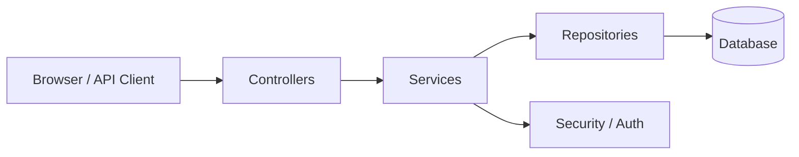

# Airline Reservation System

A backend-focused airline reservation application built with Java and Spring Boot. The project includes authentication, flight search, reservation booking, and administrative management endpoints, along with a test suite that verifies the core business rules.

## Features

- Register users and issue JWT-style tokens
- Search flights by origin, destination, and departure date
- Create bookings for a selected seat
- Prevent overbooking using seat-capacity checks
- Manage airports, aircraft, and flights through admin endpoints
- Expose API documentation with Swagger UI
- Use H2 for fast local development and testing

## Tech Stack

- Java 21
- Spring Boot 3.3
- Spring Web
- Spring Data JPA
- Spring Security
- Spring Validation
- H2 Database
- JUnit 5 + Mockito
- OpenAPI / Swagger UI

## Project Structure

```text
src/
  main/
    java/com/thanvi/airline/
      config/
      controller/
      entity/
      repository/
      service/
      AirlineReservationApplication.java
    resources/application.properties
  test/java/com/thanvi/airline/
```

## Architecture Overview



This project follows a layered Spring Boot design: controllers handle requests, services enforce the booking rules, repositories manage persistence, and security protects the admin and passenger flows.

## Demo Showcase

- The browser-based UI lives in [src/main/resources/static/index.html](src/main/resources/static/index.html) and [src/main/resources/static/app.js](src/main/resources/static/app.js).
- A simple end-to-end demo flow is available for flight search, booking creation, and admin operations.
- Screenshots can be added later to strengthen the project’s presentation on GitHub.

## Getting Started

### Prerequisites

- Java 21
- Maven 3.9+

### Run locally

```bash
export JAVA_HOME="$PWD/.tools/jdk-21.0.5+11/Contents/Home"
export PATH="$JAVA_HOME/bin:$PWD/.tools/maven/bin:$PATH"
mvn test
mvn spring-boot:run
```

The application will be available at:

- Health check: http://localhost:8080/health
- Swagger UI: http://localhost:8080/swagger-ui.html

## Demo Walkthrough

1. Start the application with Maven or Docker Compose.
2. Open http://localhost:8080/ in your browser.
3. Register a user or log in with the seeded admin account:
   - Username: admin
   - Password: admin123
4. Use the flight search form to look up routes and create a booking.
5. Review the API responses in the browser panel or through Swagger UI.

## Example Requests

### Register a user

```bash
curl -X POST "http://localhost:8080/api/auth/register?username=thanvi&password=secret"
```

### Run with Docker Compose

```bash
docker compose up --build
```

The app will be available at http://localhost:8080 and PostgreSQL will be available on port 5432.

### Search flights

```bash
curl "http://localhost:8080/api/flights/search?origin=ORD&destination=JFK&departureDate=2026-08-15"
```

### Create a booking

```bash
curl -X POST "http://localhost:8080/api/bookings?flightId=1&seatNumber=1A&firstName=Thanvi&lastName=Ambala"
```

### Create an airport via admin endpoint

```bash
curl -X POST http://localhost:8080/api/admin/airports -H "Content-Type: application/json" -d '{"code":"JFK","name":"John F. Kennedy International Airport","city":"New York"}'
```

## Notes

This repository provides a solid foundation for a full airline reservation system and can be extended further with richer UI flows, stronger validation, and production-oriented deployment features.
